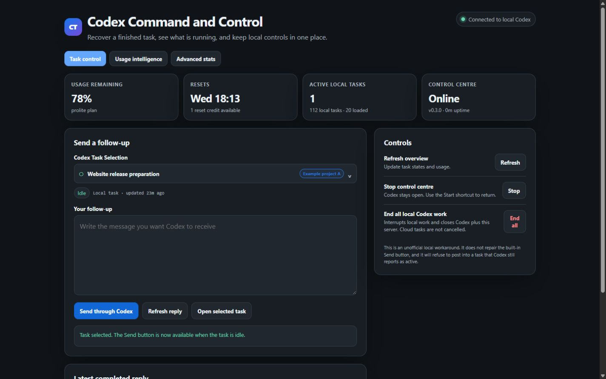
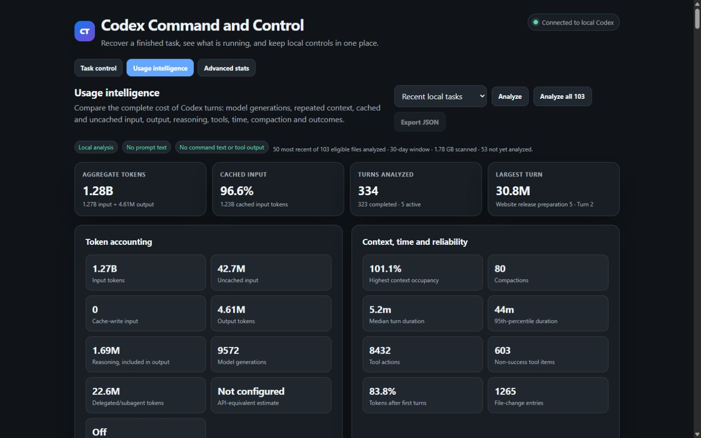
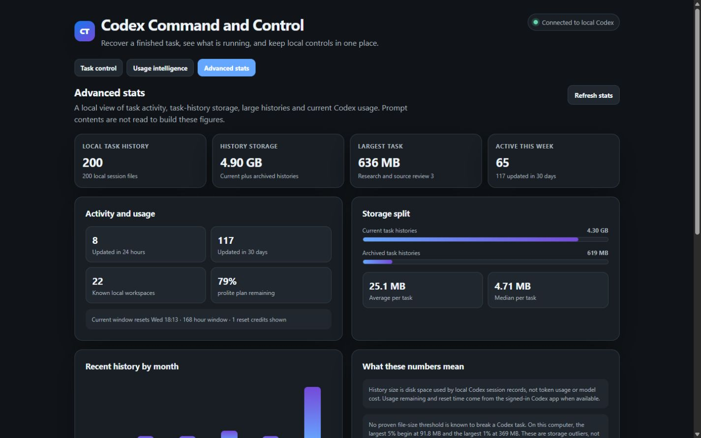

# Codex Command and Control

Codex Command and Control is an unofficial, local Windows control centre for a specific Codex desktop failure: a task finishes and its reply is complete, but the composer remains stuck with a disabled **Send** control. You can type the next prompt, yet Codex will not let you submit it. Restarting or archiving the task does not reliably restore that composer.

This project does not patch Codex. It provides a loopback-only alternative that finds the intended local task, confirms that Codex reports it as idle, and then safely sends the follow-up. It also brings the useful recovery controls and privacy-safe local usage statistics into one browser panel.

It keeps the proven status-first workaround, removes the separate floating follow-up window, and puts the useful controls in one browser panel:

- lists every current local Codex task without guessing which sidebar task is focused, loading 20 at a time as the picker is scrolled;
- displays each task's Codex project with a consistent colour;
- preselects only when Codex opens a task-aware URL containing the exact task ID;
- shows the exact task title and state before a message can be sent;
- refuses to send while the selected task is active;
- refreshes the latest completed local reply;
- shows Codex usage remaining, reset time, reset-credit availability, and local task counts;
- includes Usage Intelligence for per-turn input, cached input, output, reasoning, total tokens, model calls, context occupancy, duration, tools, failures, compactions and file changes;
- includes Prompt Lab comparisons and optional local outcome tags for cost-versus-quality analysis;
- provides a privacy-safe JSON reporter that another Codex task can inspect for efficiency advice;
- includes an Advanced Stats page for task-history storage, largest histories, recent activity, and six-month trends;
- replaces the follow-up box's odd browser menu with local Windows spelling suggestions and familiar edit actions;
- starts from a desktop or Start Menu shortcut;
- can deliberately stop the control centre or end all local Codex work.

The server binds only to `127.0.0.1`. It has no telemetry and does not write a separate copy of prompt text.

## Screenshots

### Task control



### Usage intelligence



### Advanced stats



> [!IMPORTANT]
> This is a workaround, not a repair to the Codex desktop composer. It relies on a private local host connection that a future Codex update may change.

## Support the project

If Codex Command and Control has saved you time and you would like to support its continued development, contributions are very much appreciated.

**Wallet:** `0x0C0fAAc6AaAeB4C40aCBDc0CB9DC45765750811c`

Please double-check the address and use a compatible network before sending. Blockchain transfers are irreversible.

## Easiest installation: ask Codex

Open a fresh Codex task and paste this:

```text
Install Codex Command and Control from https://github.com/LT7T/codex-control-command on this Windows computer. Follow CODEX_INSTALL.md exactly. Review the security-sensitive scripts and privacy-safe usage parser before running them, install the local app, start it without opening an external browser, verify its health endpoint and raw-statistics report shape, identify this exact Codex task, and open the control centre in this task's internal browser with the task selected. Do not send a test follow-up and do not stop any running task during installation.
```

The plain-language walkthrough is in [HUMAN_GUIDE.md](HUMAN_GUIDE.md). The agent-facing procedure is in [CODEX_INSTALL.md](CODEX_INSTALL.md).

## Requirements

- Windows 10 or 11
- the OpenAI Codex desktop app
- Node.js 20 or later
- PowerShell 5.1 or later

## Manual installation

```powershell
git clone https://github.com/LT7T/codex-control-command.git
Set-Location .\codex-control-command
& '.\plugins\codex-task-control\scripts\Install-CodexTaskControl.ps1' -Start
```

The default installation directory is `%LOCALAPPDATA%\CodexTaskControl`. Installation creates Start Menu shortcuts and, unless disabled, two desktop shortcuts:

- **Start Codex Command and Control** — `Ctrl+Alt+Shift+R`
- **End All Local Codex Work** — `Ctrl+Alt+Shift+X`

The old standalone follow-up popup is not installed.

## Using the control centre

1. Keep Codex open and start **Codex Command and Control**.
2. If the page was opened at the bare localhost URL, choose the intended task by title. If Codex opened a task-aware URL, verify the preselected title.
3. Wait until the task state is no longer `active`.
4. Write the follow-up and select **Send through Codex**. Send remains unavailable until a task is selected and while that task is active.
5. Leave the page open while it checks for the reply, or use **Refresh reply** later.

Misspelled words keep their red underline. Right-click a word in the follow-up box for Windows spelling suggestions and the usual Undo, Redo, Cut, Copy, Paste, and Select all actions. The check is local: only that one word goes to the loopback server, and no remote spelling service is used.

You normally do not need to copy a `codex://threads/...` link. When a Codex agent opens the panel it passes the exact task ID in the URL. A page opened directly at the bare localhost address cannot reliably know which Codex sidebar task is focused, so it deliberately starts with no task selected.

The picker opens with the 20 most recently updated current tasks. Scroll to the bottom, or use its **Load more** row, to append the next 20 until every current local task is available. Archived tasks and delegated subagent sessions are intentionally excluded.

## Usage intelligence

Select **Usage intelligence** to analyze either the selected task or a bounded window of recent local tasks. The dashboard reports:

- turn-level input, cached input, uncached input, output, reasoning, and aggregate tokens;
- model generations, model choice, reasoning effort, root versus delegated work, and cache ratio;
- wall-clock duration, time to first token when available, tool actions, tool failures, file-change entries, and compactions;
- current and maximum context-window occupancy based on reported model input;
- model, reasoning-effort, project, tool, and daily breakdowns;
- a turn-cost ledger and Prompt Lab comparison between any two analyzed turns;
- optional local quality, acceptance, correction, task-category, prompt-strategy, and review-time annotations.

The parser streams JSONL records instead of loading entire histories at once. The control centre initially analyzes the 50 most recently updated eligible histories within the configured age window, regardless of their combined size. **Analyze all** expands that pass to every eligible current history in the same window. Parsed results are cached in memory until a session file changes. The command-line reporter retains separate file-count and byte limits for scripted use.

The displayed total is a **turn model-token total**, not merely the words typed in the prompt. One turn may involve many model generations, each with instructions, existing context, tools and tool results. Reasoning tokens are reported as a subset of output tokens and are not added a second time.

Raw model-token totals are not automatically equal to ChatGPT/Codex subscription credits or an API invoice. The app keeps subscription usage remaining, model-token usage, elapsed time and local storage as separate measurements.

### Ask Codex to inspect the raw statistics

The installed app includes a content-free JSON reporter. A Codex task can run it and give evidence-based advice without receiving prompt text, command text, file paths, tool arguments, tool outputs or account identifiers.

For one task:

```powershell
& "$env:LOCALAPPDATA\CodexTaskControl\Get-CodexUsageStats.ps1" -ThreadId <task-id> -Pretty
```

For a recent cross-task view:

```powershell
& "$env:LOCALAPPDATA\CodexTaskControl\Get-CodexUsageStats.ps1" -Days 30 -MaxSessions 50 -Pretty
```

Then ask Codex to compare like-for-like turns, identify context growth, unusually expensive model loops, retries, tool failures, compaction effects, or model/reasoning trade-offs. Outcome tags are important because fewer tokens do not automatically mean a better result.

## Advanced stats

Select **Advanced stats** at the top of the control centre to inspect local task-history counts, current versus archived storage, the largest task histories, recent activity windows, known workspaces, six-month storage activity, and the signed-in Codex usage window.

Storage figures are based on local session-file metadata. They are not token counts or model costs, and prompt contents are not read to calculate them.

The largest-history table marks tasks in the top 5% and top 1% of storage on that computer. These are comparative local outliers, not a prediction that the task will fail. No reliable local-file-size threshold is known to break a Codex task, and long conversations may be compacted into a smaller active model context. For large histories older than Codex's recent-task list, the app asks the local Codex host for the saved title; if that task can no longer be resolved, it keeps a short task-ID fallback.

The selection follows common agent-dashboard patterns: OpenAI has shown session summaries alongside duration and token usage for long-running Codex work, while GitHub Copilot reports activity trends, feature adoption, model use, and acceptance signals. This local app includes only measurements it can establish safely and does not turn file size or activity into a productivity score.

- [OpenAI: Run long horizon tasks with Codex](https://developers.openai.com/blog/run-long-horizon-tasks-with-codex)
- [GitHub: Interpreting Copilot usage and adoption metrics](https://docs.github.com/en/copilot/reference/copilot-usage-metrics/interpret-copilot-metrics)

## Configuration

Edit `%LOCALAPPDATA%\CodexTaskControl\config.json`, then restart the control centre.

```json
{
  "port": 47651,
  "recentTaskLimit": 20,
  "maxPromptBytes": 262144,
  "analyticsWindowDays": 30,
  "analyticsMaxSessions": 50,
  "analyticsIncludeArchived": false,
  "measurePromptSize": false,
  "enableUsageAnnotations": true,
  "taskTokenBudget": 0,
  "dailyTokenBudget": 0,
  "modelPricingUsdPerMillion": {},
  "enableEndLocalWork": true,
  "openBrowserOnShortcut": true
}
```

The network host is intentionally not configurable; it remains loopback-only.

`measurePromptSize` is off by default. When enabled, the parser may locally count characters and estimate tokens for user-message records that expose text, then immediately discards the text. Follow-ups sent through the control centre always store numeric size metadata only, never the submitted text. Not every Codex turn exposes a separately measurable user message, so turn model-token totals remain the reliable comparison unit.

Token budgets are disabled when set to `0`. They are local reference points and do not alter Codex limits. Optional API-equivalent estimates are also disabled by default because model pricing changes and ChatGPT subscription usage is not an API invoice. To enable an estimate, add a current, user-verified price per one million tokens:

```json
{
  "modelPricingUsdPerMillion": {
    "example-model-name": {
      "input": 0,
      "cachedInput": 0,
      "output": 0
    }
  }
}
```

The displayed amount is labelled **API-equivalent estimate**, never actual subscription cost. Reasoning is already included in output tokens and is not charged a second time by the calculator.

## Install the Codex plugin

The repository is also a Codex plugin marketplace. Installing the plugin teaches Codex how to install, open, update, and safely operate the local app:

```powershell
codex plugin marketplace add LT7T/codex-control-command
codex plugin add codex-task-control@codex-task-control
```

Start a new Codex task after installation so the skill is picked up.

## Update

Pull the new release and rerun the installer. Your installed `config.json` is preserved.

```powershell
git pull --ff-only
& '.\plugins\codex-task-control\scripts\Install-CodexTaskControl.ps1' -Start
```

## Uninstall

Use **Uninstall Codex Command and Control** in the Start Menu, or run:

```powershell
& "$env:LOCALAPPDATA\CodexTaskControl\Uninstall-CodexTaskControl.ps1"
```

## Safety boundaries

- A follow-up is accepted only when Codex reports the selected task as idle and its latest turn as completed, interrupted, or failed.
- Send stays disabled until a task is selected and while that task is active.
- The app does not bypass approvals, usage limits, or a genuinely active turn.
- **End all local Codex work** is a full local stop. It closes the supported Codex desktop package, known local Codex runtimes, and this control centre. It does not cancel cloud tasks.
- Process shutdown uses verified executable paths, not process names alone.
- Session files, app data, project files, and caches are not deleted.

See [SECURITY.md](SECURITY.md) and [PRIVACY.md](PRIVACY.md) before public deployment.

## Development

```powershell
npm test
powershell -NoProfile -ExecutionPolicy Bypass -File .\tests\Test-Package.ps1
```

Licensed under the [MIT License](LICENSE).

